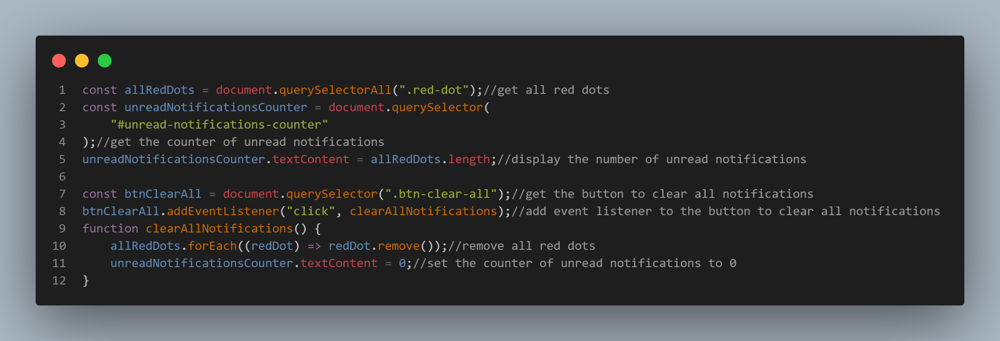

# Frontend Mentor - Notifications page


## Welcome! 👋

## The challenge

Your challenge is to build out this notifications page and get it looking as close to the design as possible.

You can use any tools you like to help you complete the challenge. So if you've got something you'd like to practice, feel free to give it a go.

Your users should be able to:

- Distinguish between "unread" and "read" notifications
- Select "Mark all as read" to toggle the visual state of the unread notifications and set the number of unread messages to zero
- View the optimal layout for the interface depending on their device's screen size
- See hover and focus states for all interactive elements on the page

### Solution

I implemented the following code in ./js/main.js to solve the challenge:


```javascript
const allRedDots = document.querySelectorAll(".red-dot"); //get all red dots
const unreadNotificationsCounter = document.querySelector(
  "#unread-notifications-counter"
); //get the counter of unread notifications
unreadNotificationsCounter.textContent = allRedDots.length; //display the number of unread notifications

const btnClearAll = document.querySelector(".btn-clear-all"); //get the button to clear all notifications
btnClearAll.addEventListener("click", clearAllNotifications); //add event listener to the button to clear all notifications
function clearAllNotifications() {
  allRedDots.forEach((redDot) => redDot.remove()); //remove all red dots
  unreadNotificationsCounter.textContent = 0; //set the counter of unread notifications to 0
}
```

Thanks for checking out this front-end coding challenge.

[Frontend Mentor](https://www.frontendmentor.io) challenges help you improve your coding skills by building realistic projects.

### Live Site URL

[Link](https://aladin002dz.github.io/ui-challenges/25-notifications-page-main/)

### Built with

- Sass.
- Mobile-first workflow.

## Useful resources

1. [Perfect Pixel](https://chrome.google.com/webstore/detail/perfectpixel-by-welldonec/dkaagdgjmgdmbnecmcefdhjekcoceebi) - This extension helps develop your websites with pixel perfect accuracy!

## Author

- Website - [Mahfoudh (aladin) Arous](https://aladin002dz.github.io/)
- Frontend Mentor - [@aladin002dz](https://www.frontendmentor.io/profile/aladin002dz)
- Twitter - [@aladin002dz](https://twitter.com/aladin002dz)
