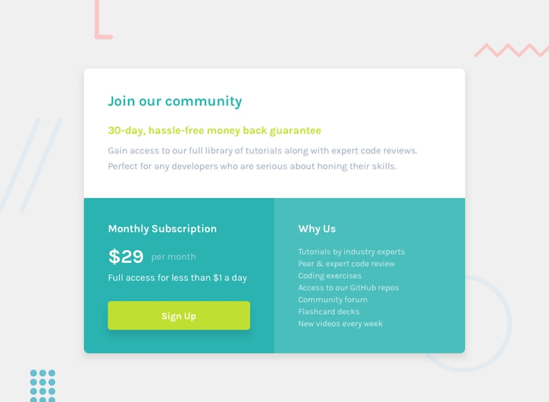

# Web UI Challenges

Challenges from https://www.frontendmentor.io/

## Demos

### Challenge1

[Link](https://aladin002dz.github.io/ui-challenges/01-single-price-grid-component/)

### Challenge2

[Link](https://aladin002dz.github.io/ui-challenges/02-social-proof-section/)

### Challenge5

[Link](https://aladin002dz.github.io/ui-challenges/05-testimonials-grid-section-main/)

### Challenge7

[Link](https://aladin002dz.github.io/ui-challenges/07-profile-card-component-main/)

### Challenge8

[Link](https://aladin002dz.github.io/ui-challenges/08-faq-accordion-card/)

### Challenge10

[Link](https://aladin002dz.github.io/ui-challenges/10-huddle-landing-page-with-single-introductory-section-master/)

### Challenge11

[Link](https://aladin002dz.github.io/ui-challenges/11-stats-preview-card-component-main/)

### Challenge12

[Link](https://aladin002dz.github.io/ui-challenges/12-3-column-preview-card-component/)

### Challenge13

[Link](https://aladin002dz.github.io/ui-challenges/13-qr-code-component/)

### Challenge14

[Link](https://aladin002dz.github.io/ui-challenges/14-nft-preview-card-component/)

### Challenge15

[Link](https://aladin002dz.github.io/ui-challenges/15-order-summary-component/)

### Challenge16

[Link](https://aladin002dz.github.io/ui-challenges/16-four-card-feature-section/)

### Challenge17

[Link](https://aladin002dz.github.io/ui-challenges/17-base-apparel-coming-soon/)

### Challenge18

[Link](https://aladin002dz.github.io/ui-challenges/18-ping-coming-soon-page/)

### Challenge19

[Link](https://aladin002dz.github.io/ui-challenges/19-interactive-rating-component/)
